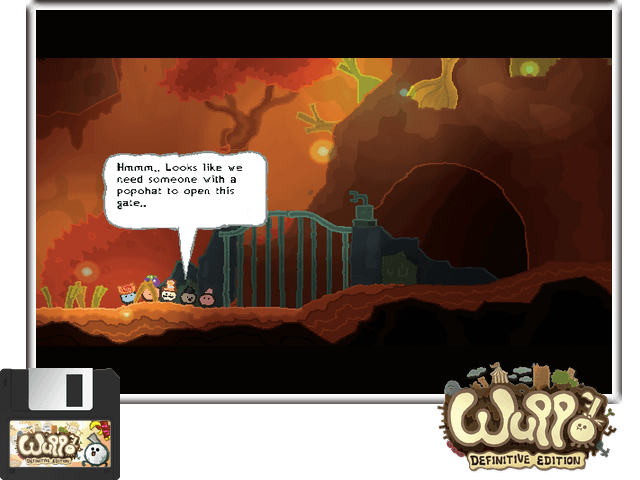

## New Port: Wuppo
**Description:** 
Play as an exiled 'wum' looking for a new home in this bizarre but charming world, filled with strange creatures, puzzles, monsters and political chaos.

**Details:**
|Detail  | info |
|--|--|
| Engine | Gamemaker Studio 2.2.2.302 |
| Architectures | 64bit|
| Aspect ratio | 16:9 or 16:10 |
| Rumble support | Yes |
| Tested versions| [Steam (Windows "Revert")](https://store.steampowered.com/app/400630/Wuppo_Definitive_Edition/)| 
| Controls | native |
| Joysticks required | Dual |

**Instructions:**
1. Install portfiles.
2. Buy Wuppo on Steam. 
3. In your steam library, right click on Wuppo and select "Properties, Betas, Revert". 
4. This will download the older Windows Definitive version of the game. 
5. Navigate to the games assets (Right click, Manage, Browse local files) and copy all files to the gamedata folder.

**Controls:**
| Button | Action |
|--|--| 
|A|Talk / Interact|
|B|Whistle|
|Y|Shortcut Window|
|L-stick|Walk|
|R-stick|Aim|
|L1|Jump|
|L2|Change Target L|
|R1|Use Item|
|R2|Change Target R|
|Up|Progress Window|
|Down|Hold Money|
|Left|Filmstrips|
|Right|Items|
|Start|Pause / Minimap|
|Select|Options|

## Requirements:
**Custom Firmwares:**
- X] AmberELEC
- [] ArkOS
- [x] ROCKNIX
- [x] MuOS
- [] Knulli**
- [] Crossmix **

**Drivers:** 
- [x] Mali
- [x] Panfrost
- [X] Adreno **

**Resolutions:** 
- [X] 480x320 ***
- [x] 640x480
- [X] 720x720*
- [x] Higher resolutions 

## Notes:
Thanks to:
* [Snekflat](https://store.steampowered.com/search/?developer=snekflat) for creating this awesome game.
* [Techbane](https://portmaster.games/profile.html?porter=Techbane) for the porting work.
* [JanTrueno](https://portmaster.games/profile.html?porter=JanTrueno) for the patching.
* [JohnnyonFlame](https://portmaster.games/profile.html?porter=Johnny%20on%20Flame) for gmloader. 

You can purchase the game here on [Steam](https://store.steampowered.com/app/400630/Wuppo_Definitive_Edition/)!

-# ** = Optional requirement
-# *** = Excluded

